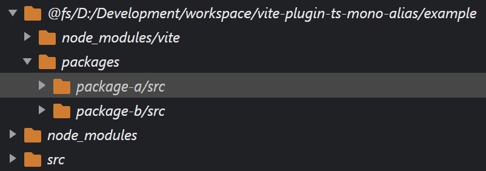

# `vite-plugin-ts-mono-alias`

A vite plugin to resolve mono-repo packages from 'src' directory, therefor no need to build packages for easy debugging. :)



## Usage

```bash
# npm
npm install vite-plugin-ts-mono-alias -D
# yarn
yarn add vite-plugin-ts-mono-alias -D
```

### configuration

```ts
// vite.config.ts
import tsMonoAlias from 'vite-plugin-ts-mono-alias';
import { defineConfig } from 'vite';

// https://vitejs.dev/config/
export default defineConfig(() => {
  return {
    // ...
    plugins: [tsMonoAlias()],
    // ...
  };
});
```

### Options

#### `ignorePackages`

> default: [process.cwd()]

Ignore packages from redirecting.

example:

```ts
// vite.config.ts
import tsMonoAlias from 'vite-plugin-ts-mono-alias';
import { defineConfig } from 'vite';

// https://vitejs.dev/config/
export default defineConfig(() => {
  return {
    // ...
    plugins: [
      tsMonoAlias({
        ignorePackages: [
          'package-a', // by package name
          '../package-a', // by path
        ],
      }),
    ],
    // ...
  };
});
```

#### `exact`

> default false.

Exactly match the importee. Such as

`import a from '@example/package-a';` - Will work.

`import a from '@example/package-a/lib/foo';` - Will not work.

## TODO

- test

#### License

MIT
